# Labs `/labs/review` Agent Flow (v1)

```mermaid
flowchart TD
    A[POST /labs/review<br/>Upload .md notes] --> B[labs/router.py::review]
    B --> C[Decode file content as UTF-8]
    C --> D[LabPostService.enqueue_markdown_organization]
    D --> E[Background task:<br/>MarkdownHelper.process_and_save_markdown]

    E --> F[LabPostWriterAgent.organize_notes]

    F --> F1[enrich_context_with_repositories<br/>GitHub repo metadata + README excerpts]
    F1 --> F2[LabCodeExampleAgent.extract_examples]
    F2 --> F3{Code examples available?}
    F3 -->|No| F4[Continue with warnings]
    F3 -->|Yes| F5[Append Code Examples Context]
    F4 --> F6[Build final writer context]
    F5 --> F6

    F6 --> G[OpenAI Writer generates initial draft]
    G --> H{Draft empty?}
    H -->|Yes| H1[Fallback message]
    H -->|No| H2[Use draft]
    H1 --> I
    H2 --> I

    I[3 review/improve cycles] --> J[LabReviewerAgent.revise<br/>Groq structured output]
    J --> K{Structured review fails?}
    K -->|Yes| K1[Fallback raw review]
    K -->|No| K2[Use structured revised_post + feedback lists]
    K1 --> L
    K2 --> L

    L[OpenAI Writer applies feedback] --> M{Improved markdown empty?}
    M -->|Yes| M1[Fallback to reviewer/current version]
    M -->|No| M2[Accept improved markdown]
    M1 --> N[Next cycle / finish]
    M2 --> N

    N --> O[Final reviewed_markdown]

    O --> P[LabPostMetadataAgent.generate<br/>OpenAI structured metadata]
    P --> Q{Metadata invalid/fails?}
    Q -->|Yes| Q1[Use default metadata]
    Q -->|No| Q2[Use generated metadata]
    Q1 --> R
    Q2 --> R

    R[Compose EN markdown with normalized frontmatter] --> S[Write EN markdown file]

    S --> T[LabPostTranslatorAgent.translate<br/>OpenAI to pt-BR]
    T --> U{Translation empty?}
    U -->|Yes| U1[Fallback to EN markdown]
    U -->|No| U2[Use translated markdown]
    U1 --> V
    U2 --> V

    V[Compose PT-BR markdown with same metadata] --> W[Write PT-BR markdown file]

    W --> X[PDFHelper.render_markdown_to_pdf<br/>EN + PT-BR]
    X --> Y{PDF render fails?}
    Y -->|Yes| Y1[Keep markdown files, log error]
    Y -->|No| Y2[Persist both PDFs]

    E --> Z{Unhandled exception before EN write?}
    Z -->|Yes| Z1[Write failure file with error]
    Z -->|No| Z2[Preserve written markdown and log]
```

## Agent Stack Used in `/labs/review`
- `LabPostWriterAgent` (OpenAI)
- `LabCodeExampleAgent` (OpenAI)
- `LabReviewerAgent` (Groq)
- `LabPostMetadataAgent` (OpenAI)
- `LabPostTranslatorAgent` (OpenAI)
